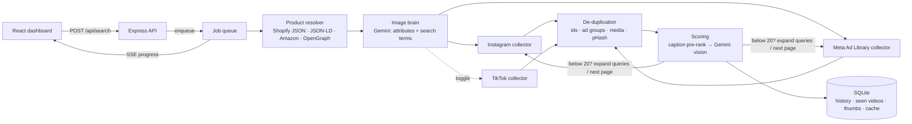

# Product Video Discovery Dashboard

Type a product name or paste a product link, and get **20 Instagram Reels and 20 Meta Ad Library video ads that show that exact product**. An image-analysis brain reads the product photo, writes the searches, and scores every video 0–100 against the photo with a reason. Repeat searches only show videos you have not seen before.

- **Backend:** Node.js 22, Express 5, SQLite (built-in `node:sqlite`), Server-Sent Events
- **Frontend:** React 19 + Vite
- **Vision:** Google Gemini (`gemini-2.5-flash` by default)
- **Video sources:** Apify actors for Instagram Reels, the Meta Ad Library, and optionally TikTok

It runs in **demo mode** when no API keys are set. Demo mode uses deterministic generated data that includes reposts, the same ad under several IDs, and weak matches, so the whole pipeline (de-duplication, query expansion, scoring, UI) can be reviewed without spending credits. A "Demo data" badge in the header shows which mode is running.

---

## Quick start

### Docker (one command)

```bash
cp .env.example .env        # optional: add GEMINI_API_KEY and APIFY_TOKEN
docker compose up --build   # open http://localhost:8080
```

### Local development

```bash
npm install && npm run setup   # installs root, backend and frontend
cp .env.example backend/.env   # optional: add keys
npm run dev                    # API on :4000, dashboard on http://localhost:5173
npm test                       # backend unit tests
```

Requires Node.js 22.13 or newer.

### Keys

| Variable | Where to get it | Used for |
|---|---|---|
| `GEMINI_API_KEY` | aistudio.google.com/apikey | Product analysis and video scoring |
| `APIFY_TOKEN` | console.apify.com → Settings → Integrations | Instagram, Meta Ad Library, TikTok scraping |

If either key is missing, the app runs in demo mode. Set `MOCK_MODE=false` to force live mode. Set `MOCK_FAIL_SOURCE=meta` to simulate a source outage in demo mode.

---

## Architecture



```
backend/
  src/server.js              Express app, error handling, logging
  src/routes/api.js          REST + SSE endpoints, input validation, rate limit
  src/services/pipeline.js   One search: resolve → analyse → collect/dedupe/score per source → save
  src/services/jobs.js       In-process job queue with replayable event streams
  src/services/productResolver.js  Product page → title, description, image (SSRF-safe)
  src/services/dedup.js      Duplicate and near-duplicate detection
  src/services/thumbs.js     Thumbnail download, perceptual hash (dHash)
  src/brain/analyze.js       Gemini: visual attributes + platform search terms
  src/brain/score.js         Hybrid scoring, threshold, score bands
  src/brain/mock.js          Demo-mode brain
  src/collectors/*.js        Apify Instagram / Meta / TikTok + demo collectors
  src/lib/safeFetch.js       SSRF guard for user-supplied URLs
  src/db/                    Schema, cache, repository
  test/                      node:test unit tests
  scripts/evaluate.js        Multi-product test report generator
frontend/src/
  App.jsx                    State, SSE handling, shortlist + CSV export
  components/                SearchBar, ProductPanel, Pipeline, Results, VideoCard, History
```

### API

| Method | Path | Purpose |
|---|---|---|
| `POST` | `/api/search` | Multipart form: `query` (name or URL), optional `image`, `includeTiktok`. Returns `202 {id}` |
| `GET` | `/api/search/:id/events` | SSE stream of pipeline progress (replays past events for late joiners) |
| `GET` | `/api/search/:id` | Search status, product, analysis, summary and all results |
| `GET` | `/api/history` | Earlier searches with per-source counts |
| `GET` | `/api/thumbs/:uid` | Stored thumbnail for a video |
| `GET` | `/api/health` | Mode, minimum per source, threshold |

### Why these choices

- **Gemini for vision.** It accepts many images in one request, so the product photo and 8 thumbnails are compared side by side in a single call. It also supports strict JSON output schemas. Gemini Flash is cheap enough to score 40–120 candidates per search. The model is configurable with `GEMINI_MODEL`.
- **Apify for sourcing.** Instagram has no public search API, and the Meta Ad Library API does not cover ordinary product ads in India (see below). Managed scrapers handle proxies, login walls and layout changes, which a 24-hour build should not reimplement. Actor IDs are environment variables, and the normalisers accept several field-name variants, so switching providers is a config change.
- **SQLite via `node:sqlite`.** History, de-duplication and caching need relational lookups but not a server. This removes a native dependency and a database container.
- **In-process job queue, not BullMQ.** Searches are long (seconds to minutes) but few, and the brief rewards one-command setup. The queue has bounded concurrency, its state is persisted in SQLite, and interrupted jobs are marked failed on restart. Its interface (`enqueue`, an event stream per job) maps directly onto a BullMQ worker if several API instances are ever needed.
- **SSE, not WebSockets.** Progress only flows one way, SSE works through nginx with `proxy_buffering off`, and the client falls back to polling if the stream drops.

---

## Video sourcing

| Source | Method | Why |
|---|---|---|
| Instagram Reels | Apify `apify~instagram-hashtag-scraper` with `resultsType: "reels"` | No public search API. The Graph API hashtag search needs a Business account and allows 30 hashtags per 7 days |
| Meta Ad Library | Apify `curious_coder~facebook-ads-library-scraper`, given the same Ad Library search URL the website uses (`active_status=active`, `media_type=video`, `country=IN`) | The official `ads_archive` API only returns political/issue ads and ads delivered in the EU/UK, so it misses normal product ads running in India |
| TikTok (optional) | Apify `clockworks~tiktok-scraper` keyword search | Behind its own toggle. It runs in parallel and never blocks the required sources |

**Rate limits, blocks, login walls and missing data**

- Every Apify call has a timeout and up to 2 retries with exponential backoff. HTTP 429 honours `Retry-After`.
- Auth (401/403), out-of-credit (402) and unknown-actor (404) errors are fatal for that source and are reported in the UI instead of being retried.
- Rows the scraper marks as errors (blocked, login wall) are logged and dropped. Image posts and image or carousel ads are dropped by the normalisers.
- A missing thumbnail does not drop the video. It is scored on its caption only, and caption-only scores are capped at 50, below the threshold.
- Sources run in parallel with `Promise.allSettled` and a per-source deadline (`SOURCE_TIMEOUT_MS`). A source that fails twice in a row is treated as down, and the other source still returns its results.
- Scrape results are cached for 6 hours per (actor, input), so retries and repeat searches don't pay twice.

**When a source returns fewer than 20 usable videos**, the collector keeps going through a query plan until it has 20 matches above the threshold:

1. Product-specific hashtags or queries written by the brain
2. Expanded and related terms (broader hashtags, category queries)
3. Deeper pages of both lists (larger result limits), alternating, up to `MAX_EXPANSION_ROUNDS`

Unscored candidates wait in a pool ranked by caption relevance, and are scored before any new fetch. If the plan runs out, the UI shows a shortfall notice for that source. The notice explains what happened (fetched, duplicates, seen before, below threshold) and what to try next. It never fails silently.

---

## Image-analysis brain

**1. Analyse.** Gemini receives the product photo, the page title and the description. It returns a strict JSON object containing:

- product type, colours, prints/graphics, logos, text on the product, material, shape, brand
- the *distinctive features* that separate this product from look-alikes
- a one-sentence "recognise it by" summary
- 8–12 Instagram hashtags, 4–6 Meta Ad Library queries, and broader fallback hashtags and queries

The analysis is cached by image hash and text, so the same product isn't re-analysed.

**2. Pre-rank (free).** Each candidate's caption or ad copy is compared with the detected attribute keywords. This only decides which candidates reach the vision model first. It does not make a video a match.

**3. Visual score.** Gemini sees the reference photo next to a batch of up to 8 thumbnails and scores each against this rubric:

| Score | Meaning |
|---|---|
| 90–100 | The same product: same print/graphic, colours, logo/text and shape |
| 70–89 | Almost certainly the same product (different angle, partly hidden, worn or used) |
| 55–69 | Probably the same, but key details are not visible |
| 35–54 | Same category or style, different design/colour/brand |
| 0–34 | Unrelated, or product not visible |

Each score comes with a short reason citing visual evidence, for example "same skull print and black colour, worn by a model". The reason is shown on every card.

**4. Combine and threshold.** The final score is 85% visual and 15% caption. A caption full of the right words cannot rescue the wrong product (visual 30 + caption 100 = 41). A clear visual match passes with an empty caption (visual 80 = 68). The **threshold is 55** (`MATCH_THRESHOLD`), the bottom of the "probably the same product" band. Videos below it are kept but hidden by default, behind "Show low matches", so near misses can be reviewed.

**Without a photo**, a keyword search still works. The brain describes the product from text, and thumbnails are judged against that description. This is less exact, so the UI asks for a photo.

---

## Unique results and de-duplication

Every video returned is stored with a canonical `uid`: `platform:platformId`, or `platform:m:<sha1 of the media URL without CDN host shard and query string>`. Each search's results are stored with their score and status (`match`, `low` or `previously_seen`).

A candidate is a duplicate of something already seen, in this search or any earlier one, when **any** of these hold:

1. **Same uid.**
2. **Same ad group.** The Meta `collation_id` groups one ad running under several ad IDs.
3. **Same media file.** The same video URL path, ignoring CDN signatures.
4. **Near-identical thumbnail.** A 64-bit difference hash (dHash) within 6 bits. This catches reposts, re-uploads, crops and re-encodes; a test verifies a JPEG-40 re-encode lands within the limit while a different image does not.
5. **Same caption + same author + similar frame** (dHash within 9 bits). This catches the same ad relaunched with a new ID.

Caption alone never merges two videos, because advertisers reuse the same copy on genuinely different creatives (also covered by a test).

The check runs in two passes. A cheap pass (ids, ad groups, media URLs) drops known videos before any download. Thumbnails are then downloaded once per remaining video, both for the pHash pass and as the image sent to the vision model.

If de-duplication leaves fewer than 20 videos, the query plan above fetches more. Videos from earlier searches can still be opened deliberately with **Show previously seen**, which displays the score they got last time.

---

## Security

- **SSRF protection** for product links and every image URL:
  - only `http(s)` on ports 80/443, and no credentials in the URL
  - `localhost`, `.local` and `.internal` hostnames are blocked
  - every hostname is resolved, and blocked if any address is private, loopback, link-local, CGNAT, multicast or cloud metadata
  - the socket connects through a DNS lookup that repeats the check, which closes the DNS-rebinding gap
  - redirects are followed manually (at most 5) and every hop is re-validated
  - response size is capped
- Input is validated with zod. Uploads are limited to one image of 8 MB, which is re-encoded with sharp before use.
- There is a per-IP search rate limit (`SEARCHES_PER_MINUTE`), because searches spend scraping credits.
- All keys come from environment variables. `.env` is git-ignored, and keys are redacted from logs.
- Platform terms: only public content is collected, through providers that respect rate limits. Thumbnails are stored as small copies to display results. Videos are linked to and played from the original source, never re-hosted.

## Caching

| What | Key | TTL |
|---|---|---|
| Product page resolution | URL | 7 days |
| Product analysis | image hash + text | 7 days |
| Scraper results | actor + input | 6 hours |
| Thumbnails | video uid | permanent (small JPEGs; CDN links expire) |

## Logging, errors and tests

- Structured JSON logs (pino) with request logging.
- Every error response is `{ "error": "<what happened and what to do>" }`.
- `npm test` runs 25 unit tests covering:
  - de-duplication: ids, Meta ad groups, media URLs, pHash reposts, caption rules, cross-search history
  - scoring: weights, threshold, bands, query plan
  - SSRF guard
  - product page parsing: JSON-LD, OpenGraph, Amazon
  - collector normalisers

---

## Test evidence

`backend/scripts/evaluate.js` runs any list of products through a running API and prints a Markdown report. The report shows per-source counts, rejected candidates, median score, and examples of good and rejected matches.

```bash
API=http://localhost:4000 node backend/scripts/evaluate.js \
  "oversized graphic tee" "protein dark chocolate" "stainless steel insulated water bottle" \
  "wireless earbuds with charging case" "ceramic hair straightener brush"
```

**Demo-mode run** (generated data; this shows the report format and pipeline behaviour, not real-world accuracy):

| Product | Instagram matches | Meta matches | Low / rejected | Seen before | Median score | Time |
|---|---|---|---|---|---|---|
| oversized graphic tee | 30/20 | 21/20 | 29 | 0 | 78 | 3s |
| protein dark chocolate | 31/20 | 22/20 | 23 | 1 | 76 | 2s |
| stainless steel insulated water bottle | 33/20 | 20/20 | 21 | 3 | 78 | 2s |
| wireless earbuds with charging case | 26/20 | 20/20 | 24 | 1 | 76 | 3s |
| ceramic hair straightener brush | 34/20 | 21/20 | 17 | 1 | 74 | 3s |

Repeating the same search four times in demo mode returned new videos each time. The fourth Meta search hit a reported shortfall once the generated pool ran out, which is the intended behaviour.

**Live run with real keys:** _to be added. Run the command above with `GEMINI_API_KEY` and `APIFY_TOKEN` set, then paste the table and examples here._

---

## Known limitations

- **Live providers were not exercised from the build environment.** Its network blocked outbound calls to Apify, Gemini and store websites. The live paths follow the providers' documented request formats and are covered by unit tests on recorded response shapes, but the first live run should be checked against the logs.
- **Scraper output changes.** Apify actors occasionally rename fields. The normalisers accept several variants, but a new layout can still drop items. Those items are logged, not crashed on.
- **Amazon and some large stores block server-side fetches.** The resolver detects CAPTCHA and block pages and says so. The workaround is a product name plus an uploaded photo.
- **Thumbnail-only matching.** The scoring compares a single cover frame, so a video where the product appears only mid-clip can be under-scored. See below.
- **Video playback.** Inline playback uses the source's media URL, which can expire or refuse cross-origin playback. "Open original" always works.
- **Single instance.** The queue and rate limiter are in-process. Several API instances would need Redis (BullMQ) and a shared database.
- **Accuracy depends on the model.** Gemini Flash can confuse near-identical designs from different brands. Switching `GEMINI_MODEL` to a Pro model improves this at higher cost.

## What I would build next

1. Score 3–4 keyframes per video (ffmpeg on the media URL) instead of only the cover thumbnail.
2. Add a local CLIP/SigLIP embedding pre-filter (pgvector or sqlite-vec), so only close candidates reach the paid vision model, cutting cost by roughly 3–5×.
3. Use BullMQ + Redis and Postgres for horizontal scaling, with per-user history.
4. Feed shortlist and reject clicks back as few-shot examples to tune the threshold per category.
5. Add a fallback provider per source (for example Playwright against the public Ad Library) for when a scraper is down.

## Demo video outline (3–5 min)

1. Search by product name with a photo. Show the live progress and the detected attributes.
2. Search by product link (a Shopify product URL). Show the resolver output.
3. Show both tabs at 20/20 or more, with scores, reasons, low matches and sorting.
4. Repeat the same search. Show only new videos, then the "Show previously seen" toggle.
5. Show the history panel, the shortlist and its CSV export, and a simulated source outage (`MOCK_FAIL_SOURCE=meta`).
